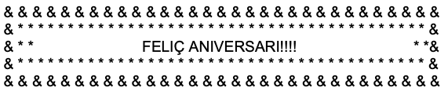
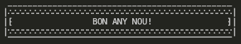
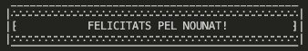
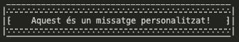
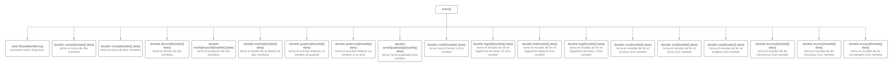

# TEMA_3_METODES_22_23_IB.pdf

[TEMA_3_METODES_22_23_IB.pdf](TEMA_3_METODES_22_23_IB/TEMA_3_METODES_22_23_IB.pdf)

**Programes per completar**
1.- Modifiqueu el programa 2 per calcular la distancia entre dos punts de l’espai a partir de les seves coordenades: (x0, y0) , (x1, y1)

```java
import java.util.*;

public class RunEveryProgramme {
    public static void main(String args[]){
        Scanner input = new Scanner(System.in);

        double x1, y1, x2, y2;
        System.out.print("Introdueix la coordenada x1: ");
        x1 = input.nextInt();
        System.out.print("Introdueix la coordenada y1: ");
        y1 = input.nextInt();
        System.out.print("Introdueix la coordenada x2: ");
        x2 = input.nextInt();
        System.out.print("Introdueix la coordenada y2: ");
        y2 = input.nextInt();
        
        System.out.println("La distància és " + dist(x1, y1, x2, y2));
    }

    public static double dist(double x1, double y1, double x2, double y2){ //funció que calcula la distàcia entre dos punts
        return Math.sqrt(Math.pow(x2-x1, 2) + Math.pow(y2-y1, 2));
    }
}
```

2.- Modifiqueu el programa 3 de manera que es calculi el número resultant d’escriure en ordre invers les xifres d’un número enter. Per exemple, invert(321) = 123.

```java
import java.util.Scanner;

public class RunEveryProgramme{
    public static void main(String[ ] args) {
        int num;

        System.out.println("Programa que calcula la suma dels seus digits ");
        System.out.println("Introduiu un numero enter positiu: ");
        Scanner input = new Scanner (System.in);
        num = input.nextInt();
        
        System.out.println("La suma dels dígits del numero: " + num + " és " + sum_digit(invert(num)));
    }

    public static int invert(int n){
        int inverted = 0; //variable on va acumulant els digits revertits
        while(n != 0){ //fins que el numero d'entrada no es faci zero
            inverted = inverted*10 + n%10; // agafa el numero invertit ja existent i hi fa
                                           // un forat a les unitats (*10), seguidament
                                           // hi suma les unitats del número introduit
            n = n/10; //elimina aquesta unitat que ja hem acumulat
        }
        return inverted; // retorna el nombre invertit en tipus int
    }

    public static int sum_digit(int n) {
        int suma = 0;
        if (n < 0) n = -n;
            while (n!=0) {
            suma = suma + n%10;
            n = n/10;
        }
        return suma;
    }
}
```

**Programes per desenvolupar**
1.- Modifiqueu el programa 2 per calcular la distancia entre dos punts de l’espai a partir de les seves coordenades: (x0, y0) , (x1, y1) i creant una funció per calcular la potencia d’un número.

```java
import java.util.*;

public class RunEveryProgramme {
    public static void main(String args[]){
        Scanner input = new Scanner(System.in);

        double x1, y1, x2, y2;
        System.out.print("Introdueix la coordenada x1: ");
        x1 = input.nextInt();
        System.out.print("Introdueix la coordenada y1: ");
        y1 = input.nextInt();
        System.out.print("Introdueix la coordenada x2: ");
        x2 = input.nextInt();
        System.out.print("Introdueix la coordenada y2: ");
        y2 = input.nextInt();
        
        System.out.println("La distància és " + dist(x1, y1, x2, y2));
    }

    public static double dist(double x1, double y1, double x2, double y2){
        return Math.sqrt(potencia(x2-x1, 2) + potencia(y2-y1, 2));
    }

    public static double potencia(double base, int exponent){
        if(exponent == 0){
            return 1.0; //n^0 = 1 
        }

        return base * potencia(base, exponent-1); //patró recursiu, va restant u al exponent

    }
}
```

2.- Implementeu un programa amb una funció: bool es_primer(int n) que ens confirmi si un nombre es primer o no.

```java
import java.util.*;

public class RunEveryProgramme {
    public static void main(String args[]){
        Scanner input = new Scanner(System.in);

        System.out.print("Introdueix un nombre: ");
        int n = input.nextInt();

        if(es_primer(n))    System.out.println(n + " és un nombre primer.");
        else    System.out.println(n + " és un nombre compost.");
        
    }
    

    public static boolean es_primer(int n){
        if(n <= 1)  return false; //és negatiu, 0 o 1. Tots tres casos no són primers  

        for(int i = 2; i <= n/2; i++){ //recorre tots els nombres entre 2 i la meitat del número en questió
            if((n%i) == 0)  return false; //si al dividir per un nombre el residu és 0 vol dir que és divisior
                                          //com en el for loop no s'hi té en compte ni el mateix nombre ni l'u,
                                          //estariem davant d'un nombre compost
        }

        return true; //si ninguna de les condicions és certa, vol dir que és primer
    }

}
```

**Programes opcionals**
1.- Escriu un programa que calculi quantes combinacions de n elements agrupats de m en m són possibles en base a la formula : Cmn = m! / n! (m-n)! Divideix el programa en funcions.

```java
import java.util.*;

public class RunEveryProgramme {
    public static void main(String args[]){
        Scanner input = new Scanner(System.in);

        System.out.println("En base a Cmn = m! / n!(m-n)!");
        
        System.out.print("Nombre d'elements (n): ");
        int n = input.nextInt();
        System.out.print("Nombre d'elements per grup (m): ");
        int m = input.nextInt();

        
        System.out.println("Nombre de combinacions = " + cmn(n, m));
        
        
    }
    
    public static double cmn(int n, int m){
        // array content: {factorial_n, factorial_m, factorial_n_menys_m}
        double factorials[] = getFactorials(n, m); //crida getFactorials per calcular els factorials de n i m
        return factorials[0] / (factorials[1] * factorials[2]); //retorna el valor de la formula
    }

    //funció recursiva per trobar el factorial d'un nombre
    public static double factorial(int n) { 
        if(n == 0) return 1.0; // factorial d'1 és 1
        else return n*factorial(n-1); //multiplica el nombre n per el seu anterior fins que sigui 1
    }

    //calcula els factorials de n, m i n-m i els retorna en forma de llista
    public static double[] getFactorials(int n, int m){
        double factorial_n = factorial(n);
        double factorial_m = factorial(m);
        double factorial_n_menys_m = factorial(n-m);

        double factorials[] = {factorial_n, factorial_m, factorial_n_menys_m};

        return factorials;
    }
}
```

2.- Escriu un programa que mostri diferents felicitacions per pantalla. L’usuari ha de poder triar la felicitació des d’un menú amb diferents tipus de felicitació: d’aniversari, de Nadal, d’any nou, etc. Les felicitacions han de muntar-se a base de caràcters i símbols:
S’han d’utilitzar una funció o acció per a cada felicitació.



```java
import java.util.*;

public class RunEveryProgramme {
    public static void main(String args[]){
        Scanner input = new Scanner(System.in);
        
				//són totes les opcions que es dona al client
        String[] options = {"ENHORABONA!",
                            "FELIÇ ANIVERSARI!",
                            "BON NADAL!",
                            "BON ANY NOU!",
                            "FELICITATS PEL NOUNAT!",
                            "BONES PASQÜES!",
                            "Fes-lo personalitzat!"};

        printMenu(options); //mitjançant la funció imprmeix les opcions

        System.out.println();
        System.out.println("Escull una opció: ");
        int c = input.nextInt(); //demana la opció del menú

        if(c == 7){ //en cas de que sigui el personalitzat demana el missatge
            System.out.println("Introdueix el teu missatge: ");
            String msg = input.nextLine();
            msg = input.nextLine();
            String canvas[] = generateCanvas(msg); //genera el recuadre amb el missatge
            printCanvas(canvas); //mostra el missatge
        }else{ // és una opció del menú
            String canvas[] = generateCanvas(options[c-1]); //el menys-u és perquè contem desde 0
            printCanvas(canvas);
        }
        
        
    }
    
    public static String[] generateCanvas(String message){ //afegeix el missatge al disseny
        String[] s = {  " _____________________________________________", 
                        "|∴∴∴∴∴∴∴∴∴∴∴∴∴∴∴∴∴∴∴∴∴∴∴∴∴∴∴∴∴∴∴∴∴∴∴∴∴∴∴∴∴∴∴∴∴|", 
                        "|⁅" + messagePadding(message) + "⁆|", 
                        "|∵∵∵∵∵∵∵∵∵∵∵∵∵∵∵∵∵∵∵∵∵∵∵∵∵∵∵∵∵∵∵∵∵∵∵∵∵∵∵∵∵∵∵∵∵|", 
                        " ‾‾‾‾‾‾‾‾‾‾‾‾‾‾‾‾‾‾‾‾‾‾‾‾‾‾‾‾‾‾‾‾‾‾‾‾‾‾‾‾‾‾‾‾‾"};

        return s;
    }

    public static void printMenu(String[] options){ //imprimeix el array amb les opcions
        for(int i = 0; i < options.length; i++){
            System.out.println((i+1) + "- " + options[i]);
        }
    }

    public static String messagePadding(String msg){ //dona espai per les dues vandes per a que el missatge es vegi centrat
        int length = msg.length(); //agafa la llargada del missatge
        int margin = (44 - length) / 2; //44 són els caracters que pot tindre el missatge, el restant el divideix per cada banda
				
				//afegeix els espais calculats
        if((length + margin*2) >= 44){ //podria ser que fos imparell, un costat tindrà un espai menys que l'altre
            String m1 = "";
            for(int i = 0; i < margin; i++){
                m1 = m1 + " ";
            }

            String m2 = "";
            for(int i = 0; i < margin-1; i++){
                m2 = m2 + " ";
            }
            return m1 + msg + m2; //retrona el missatge amb els dos marges
        }

        String m = ""; //els dos tenen el mateix espai
        for(int i = 0; i < margin; i++){
            m = m + " ";
        }

        return m + msg + m;//retrona el missatge amb els dos marges
    }

    public static void printCanvas(String[] c){ //mostra el array que conté el disseny i el missatge
        for(int i = 0; i < c.length; i++){
            System.out.println(c[i]);
        }
    }
}
```

Exemples d’output:







**Miniprojecte (OBLIGATORI)**
Dissenyar i implementar un programa que seguint el model del programa de l’exemple 1 presenti un menú amb les operacions d’una calculadora científica. S’ha de fer un disseny modular coherent amb l’estructura i funcionament del programa. S’ha de presentar també el diagrama “top-down” del disseny presentat.



```java
// javac Main.java; java Main.java

import java.util.*;

public class Main {
    public static void main(String args[]){
        boolean running = true; //quan sigui false el programa s'aturarà, és false quan se selecciona exit
        while(running){
        Scanner sc = new Scanner(System.in);

        ShowMainMenu();
        System.out.print("Selecciona una funcionalitat: ");
        int opt = sc.nextInt();

        switch(opt){
            case 1: //Suma
                System.out.println("a + b");
                System.out.println(suma(askForData(2)));

                break;
            
            case 2: //Resta
                System.out.println("a - b");
                System.out.println(resta(askForData(2)));

                break;

            case 3: //Multiplicació
                System.out.println("a * b");
                System.out.println(multiplicació(askForData(2)));

                break;

            case 4: //Divisió
                System.out.println("a / b");
                System.out.println(divisió(askForData(2)));

                break;

            case 5: //Mòdul
                System.out.println("a % b");
                System.out.println(modul(askForData(2)));

                break;

            case 6: //Quadrat
                System.out.println("a^2");
                System.out.println(quadrat(askForData(1)));

                break;    

            case 7: //Potencia
                System.out.println("a^b");
                System.out.println(potencia(askForData(2)));

                break;

            case 8: //Arrel quadrada
                System.out.println("sqrt(a)");
                System.out.println(arrelQuadrada(askForData(1)));

                break;

            case 9: //Arrel d'ordre x
                System.out.println("root(a, b) -- a is the index");
                System.out.println("           -- b is the radicant");
                
                System.out.println(root(askForData(2)));

                break;
            
            case 10: //Logaritme base 10
                System.out.println("log10(a)"); 
                System.out.println(log10(askForData(1)));

                break;
            
            case 11: //Logaritme neperià
                System.out.println("ln(a)"); 
                System.out.println(ln(askForData(1)));

                break;
            
            case 12: //Logaritme de base x
                System.out.println("log(a, b) -- a is the base"); 
                System.out.println("          -- b is the argument");
                System.out.println(log(askForData(2)));

                break;

            case 13: //Sin
                System.out.println("sin(a); a is in radians"); 
                System.out.println(sin(askForData(1)));

                break;

            case 14: //Cos
                System.out.println("cos(a); a is in radians"); 
                System.out.println(cos(askForData(1)));

                break;

            case 15: //Tan
                System.out.println("tan(a); a is in radians"); 
                System.out.println(tan(askForData(1)));

                break;

            case 16: //ArcSin
            System.out.println("arcsin(a)"); 
            System.out.println(arcsin(askForData(1)));

            break;

            case 17: //ArcCos
                System.out.println("arccos(a)"); 
                System.out.println(arccos(askForData(1)));

                break;

            case 18: //ArcTan
                System.out.println("arctan(a)"); 
                System.out.println(arctan(askForData(1)));

                break;

            case 19:
                System.out.println("Exiting...");
                running = false;
                break;
            
            default:
                System.out.println("Insereix un nombre vàlid.");
                
        }
        try {
            Thread.sleep(2000);    //per a que doni temps a llegir el missatge
                                                    //abans de que es mostri el menú de nou
        } catch (InterruptedException ie) {
            Thread.currentThread().interrupt();
        }

        System.out.println();
        System.out.println();        
        }// end of whileLoop
    }

    public static Double suma(Double[] data){
        return data[0] + data[1];
    }

    public static Double resta(Double[] data){
        return data[0] - data[1];
    }

    public static Double multiplicació(Double[] data){
        return data[0] * data[1];
    }

    public static Double divisió(Double[] data){
        return data[0] / data[1];
    }

    public static Double modul(Double[] data){
        return data[0] % data[1];
    }

    public static Double quadrat(Double[] data){
        return data[0] * data[0];
    }

    public static Double potencia(Double[] data){
        double result = 1;
        for(int i = 0; i < data[1]; i++){
            result = result * data[0];
        }

        return result;
    }

    public static Double arrelQuadrada(Double[] data){
        return Math.sqrt(data[0]);
    }

    public static Double root(Double[] data){
        return Math.pow(data[1], 1./data[0]);
    }

    public static Double log10(Double[] data){
        return Math.log10(data[0]);
    }

    public static Double ln(Double[] data){
        return Math.log(data[0]);
    }

    public static Double log(Double[] data){
        return Math.log(data[1]) / Math.log(data[0]);
    }

    public static Double cos(Double[] data){
        return Math.cos(data[0]);
    }

    public static Double sin(Double[] data){
        return Math.sin(data[0]);
    }

    public static Double tan(Double[] data){
        return Math.tan(data[0]);
    }

    public static Double arccos(Double[] data){
        return Math.acos(data[0]);
    }

    public static Double arcsin(Double[] data){
        return Math.asin(data[0]);
    }

    public static Double arctan(Double[] data){
        return Math.atan(data[0]);
    }

    public static void ShowMainMenu(){        
        String[] listOfFunctionalities = {  "Suma",
                                            "Resta",
                                            "Multiplicació",
                                            "Divisió",
                                            "Mòdul",
                                            "Quadrat",
                                            "Potència d'x",
                                            "Arrel quadrada",
                                            "Arrel d'ordre x",
                                            "Logaritme base 10",
                                            "Logaritme neperià",
                                            "Logaritme de base x", //12
                                            "sin",
                                            "cos",
                                            "tan",
                                            "arcSin",
                                            "arcCos",
                                            "arcTan", //18
                                            "EXIT"
                                         };

        printMenu(listOfFunctionalities);
    }

    public static void printMenu(String[] list){
        for(int i = 0; i < list.length; i++){
            System.out.println((i+1) + "- " + list[i]);
        }

        System.out.println();
    }

    public static Double[] askForData(int n){
        Scanner sc = new Scanner(System.in);
        
        //n és la quantitat de dades requerides

        String[] abecedari = {"a", "b", "c", "d", "e", "f", "g",
                "h", "i", "j", "k", "l", "m", "n", "o", "p", "q", 
                "r", "s", "t", "u", "v", "w", "x", "y", "z"};
        
        Double[] data = new Double[n];

        for(int i = 0; i < n; i++){
            System.out.print(abecedari[i] + " = ");
            data[i] = sc.nextDouble();
        }

        return data;
    }
}
```
