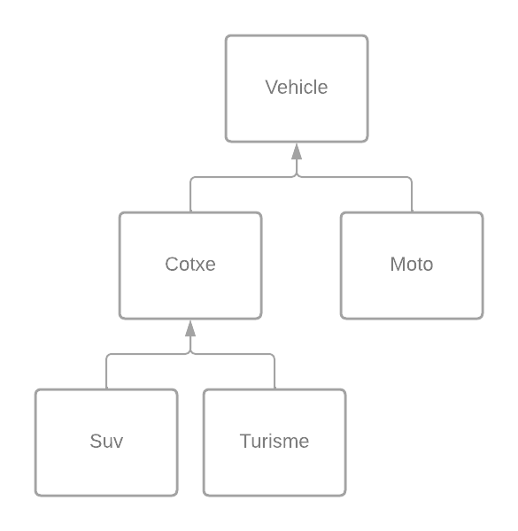
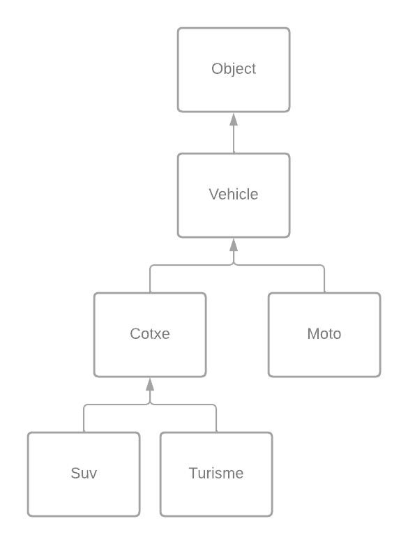

# TEMA_7_INTRO_HERENCIA_IB_2022_23_v1

[TEMA_7_INTRO_HERENCIA_IB_2022_23_v1.pdf](TEMA_7_INTRO_HERENCIA_IB_2022_23_v1/TEMA_7_INTRO_HERENCIA_IB_2022_23_v1.pdf)

**Programes per desenvolupar
1.- Afegiu les classes Turisme i Suv derivades de la classe. Implementeu-les amb els constructors, getters i setters i altres mètodes d’entrada i sortida que creieu convenients. Doneu el codi de les dues classes i el diagrama UML complet de les cinc classes.**
En aquest  es poden trobar les diferents classes que han estat utilitzades en aquestes activitats.


**2. – Feu un main on en un vector de Vehicles anomenat Automòbils es col·loquin 10 vehicles del tipus: 8 Cotxes (4 Turismes i 4 Suv) i 2 Motos. Com a sortida s’ha de fer un llistat de tots els vehicles que es disposa amb les seves característiques i el preu de venda.**

```java
public class App {
    public static void main(String[] args) {
        Vehicle[] Automobils = new Vehicle[10];

        Automobils[0] = new Turisme("SEAT", 120, 250000, 5, "benzina", "gran");
        Automobils[1] = new Turisme("AUDI", 150, 300000, 5, "diesel", "mitjà");
        Automobils[2] = new Turisme("MERCEDES", 180, 400000, 7, "diesel", "gran");
        Automobils[3] = new Turisme("BMW", 160, 350000, 5, "benzina", "mitjà");
        Automobils[4] = new Suv("FORD", 130, 280000, 5, "diesel", true);
        Automobils[5] = new Suv("VOLVO", 150, 320000, 7, "diesel", false);
        Automobils[6] = new Suv("TOYOTA", 140, 300000, 5, "gasolina", true);
        Automobils[7] = new Suv("NISSAN", 120, 250000, 7, "gasolina", false);
        Automobils[8] = new Moto("HONDA", 100, 5000, 250);
        Automobils[9] = new Moto("YAMAHA", 110, 6000, 300);

        for (Vehicle vehicle : Automobils) {
            vehicle.mostrarVehicle();
            System.out.println("Preu de venda: " + vehicle.calcularPreu());
            System.out.println("------------------------------------");
        }
    }
}
```

```
Marca: SEAT, Motor: 120, Preu: 250000.0
Preu de venda: 406250.0
------------------------------------
Marca: AUDI, Motor: 150, Preu: 300000.0
Preu de venda: 487500.0
------------------------------------
Marca: MERCEDES, Motor: 180, Preu: 400000.0
Preu de venda: 650000.0
------------------------------------
Marca: BMW, Motor: 160, Preu: 350000.0
Preu de venda: 568750.0
------------------------------------
Marca: FORD, Motor: 130, Preu: 280000.0
Preu de venda: 560560.0
------------------------------------
Marca: VOLVO, Motor: 150, Preu: 320000.0
Preu de venda: 582400.0
------------------------------------
Marca: TOYOTA, Motor: 140, Preu: 300000.0
Preu de venda: 600600.0
------------------------------------
Marca: NISSAN, Motor: 120, Preu: 250000.0
Preu de venda: 455000.0
------------------------------------
Marca: HONDA, Motor: 100, Preu: 5000.0
Preu de venda: 6000.0
------------------------------------
Marca: YAMAHA, Motor: 110, Preu: 6000.0
Preu de venda: 7200.0
------------------------------------
```

**3.- Feu les comprovacions pertinents amb l’aplicació concessionari muntada fins ara i contesteu a les següents qüestions de manera raonada:
a) Comproveu l’efecte de definir els atributs places i tipus de la classe Cotxe com a protected. Què resulta més adequat?**

*Si els atributs places i tipus es defineixen com a protected a la classe Cotxe, aquests atributs podran ser accedits per les classes que heredin de Cotxe, però no per altres classes que no heredin de Cotxe.*

*En general, la decisió de definir els atributs com a protected o private depèn de l'estructura de classes que es vol implementar i dels requisits de seguretat i encapsulament del programa. En aquest cas, si es vol limitar l'accés als atributs només a les classes que hereden de Cotxe, llavors la definició com a protected podria ser adequada.*

*No obstant, si es vol limitar l'accés als atributs a través de mètodes getters i setters per mantenir un millor control dels valors assignats, llavors la definició com a private seria més adequada. Així, els mètodes getters i setters podrien incloure validacions addicionals per assegurar que els valors assignats als atributs són vàlids.*

*En general, la definició dels atributs com a protected o private depèn de les necessitats de l'aplicació i és important tenir en compte les implicacions de la definició en termes de seguretat i encapsulament del programa.*

**b) A la classe Cotxe tenim: public final double calcularPreu() Comproveu i detalleu l’efecte de tenir final o no a la definició d’aquest mètode. Resulta convenient aquesta definició en vistes del que necessitem a la nostra aplicació?**

*La paraula clau **`final`** en la definició del mètode **`calcularPreu()`** de la classe **`Cotxe`** indica que aquest mètode no pot ser sobrescrit per les classes que hereden de **`Cotxe`**. Si no s'utilitza la paraula clau **`final`**, les classes filles poden sobrescriure el mètode **`calcularPreu()`** i proporcionar una implementació diferent.*

*En aquest cas, sembla que la definició del mètode **`calcularPreu()`** com a final en la classe **`Cotxe`** té sentit, ja que el càlcul del preu del cotxe no depèn del tipus de combustible o del nombre de places (de moment) i això no hauria de canviar en les classes que hereden de **`Cotxe`**. Si les classes filles necessiten calcular el preu d'una manera diferent, poden sobrescriure el mètode **`calcularPreu()`** per proporcionar la seva pròpia implementació.*

*Per tant, en aquest cas concret, la definició del mètode **`calcularPreu()`** com a final sembla convenient i coherent amb el que es necessita a l'aplicació.*

**c) Redefiniu el mètode calcularPreu() per les dues classes noves: Turisme i Suv. Comproveu el seu funcionament per un IMPOST definit per cadascuna de 1.25 i 1.4 respectivament.**

*Redefinició del mètode **`calcularPreu()`** per les classes **`Turisme`** i **`Suv`**, amb els impostos definits per cada classe:*

```java
public class Suv extends Cotxe {
    private boolean is4x4;
    private static final double SUV_4X4_FEE = 1.1;
    private static final double IMPOST = 1.4;

    // Resta del codi de la classe Suv

    @Override
    public double calcularPreu() {
        double preu = super.calcularPreu();
        if (is4x4) {
            preu *= SUV_4X4_FEE;
        }
        return preu * IMPOST;
    }
}

public class Turisme extends Cotxe {
    private String size;
    private static final int MAX_PLACES = 7;
    private static final double IMPOST = 1.25;

    // Resta del codi de la classe Turisme

    @Override
    public double calcularPreu() {
        double preu = super.calcularPreu();
        if (getPlaces() > MAX_PLACES) {
            preu *= 1.1;
        }
        return preu * IMPOST;
    }
}
```

*En aquest exemple, la classe **`Suv`** té un impost del 1.4, que s'aplica al preu base i s'incrementa en un 10% si el cotxe és 4x4. D'altra banda, la classe **`Turisme`** té un impost del 1.25, que s'aplica al preu base i s'incrementa en un 10% si el cotxe té més de 7 places.*

*Ara, quan cridis el mètode **`calcularPreu()`** per a objectes de les classes **`Suv`** i **`Turisme`**, s'aplicarà l'impost específic i es retornarà el preu calculat. Per exemple:*

```java
Suv suv = new Suv("Dacia", 110, 15000, 5, "diesel", true);
Turisme turisme = new Turisme("Opel", 80, 17000, 5, "benzina", "gran");

System.out.println("Preu del SUV: " + suv.calcularPreu());
System.out.println("Preu del Turisme: " + turisme.calcularPreu());
```

**********************El resultat del qual:**********************

```
Preu del SUV: 23100.0
Preu del Turisme: 21250.0
```

**d) Tant a la classe Cotxe com a la classe Moto s’ha definit: private final double IMPOST Resulta més convenient posar: private final static double IMPOST Quin és el motiu i feu una comprovació demostrativa.**

*Definir la constant IMPOST com a **`private final static double`** és més convenient perquè això significa que només es crearà una instància de la constant per a totes les instàncies de la classe. Això estalvia memòria i fa que el programa sigui més eficient.*

*Si definim la constant com a **`private final double`**, cada instància de la classe tindrà la seva pròpia instància de la constant, la qual cosa és innecessari i pot portar a una sobrecàrrega de memòria.*

*Així, podem definir la constant IMPOST a la classe Cotxe i Moto com a:*

```java
private final static double IMPOST = 1.3;
```

*Per a demostrar que només es crea una instància de la constant, podem afegir un missatge d'impressió a cada constructor que mostri el valor de la constant:*

```java
public Cotxe(String marca, int motor, double preu, int places, String tipus) {
    super(marca, motor, preu);

    System.out.println("Valor de IMPOST a Cotxe constructor: " + IMPOST);

    // Validar les dades d'entrada
    if (places <= 0 || places > MAX_PLACES) {
        throw new IllegalArgumentException("El nombre de places ha de ser entre 1 i " + MAX_PLACES);
    }
    if (tipus == null || tipus.isEmpty()) {
        throw new IllegalArgumentException("El tipus de combustible no pot estar buit");
    }

    this.places = places;
    this.tipus = tipus;
}

public Moto(String marca, int motor, double preu, int cilindrada) {
    super(marca, motor, preu);

    System.out.println("Valor de IMPOST a Moto constructor: " + IMPOST);

    // Validar les dades d'entrada
    if (cilindrada <= 0) {
        throw new IllegalArgumentException("La cilindrada ha de ser un valor positiu.");
    }

    this.cilindrada = cilindrada;
}
```

*A continuació, podem crear una instància de cada classe i veurem que només es mostra el missatge d'impressió una vegada:*

*A continuació, podem crear una instància de cada classe i veurem que només es mostra el missatge d'impressió una vegada:*

```java
Cotxe c1 = new Cotxe("Seat", 120, 250000,5,"benzina");
Moto m1 = new Moto("BMW", 90, 10000,250);
```

*El resultat d'executar el programa seria:*

```
Valor de IMPOST a Cotxe constructor: 1.3
Valor de IMPOST a Moto constructor: 1.3
```

**e) Volem comparar i determinar si dos turismes són iguals, redefiniu el mètode equals a la classe Turisme i comproveu el seu efecte.**

*Per comparar si dos objectes de la classe Turisme són iguals, hem de redefinir el mètode **`equals()`** de la classe Object. Això implica sobreescriure el mètode **`equals()`** i especificar quines propietats dels objectes són significatives per a la comparació.*

*A continuació, es presenta una possible implementació del mètode **`equals()`** per la classe Turisme:*

```java
@Override
public boolean equals(Object obj) {
    if (this == obj) {
        return true;
    }
    if (obj == null || getClass() != obj.getClass()) {
        return false;
    }
    Turisme other = (Turisme) obj;
    return getMarca().equals(other.getMarca()) &&
           getMotor() == other.getMotor() &&
           Double.compare(getPreu(), other.getPreu()) == 0 &&
           getPlaces() == other.getPlaces() &&
           getTipus().equals(other.getTipus()) &&
           getSize().equals(other.getSize());
}
```

*En aquesta implementació, primer es comprova si els objectes són idèntics, és a dir, si apunten a la mateixa instància de la classe. En aquest cas, es retorna **`true`**. Si l'objecte passat com a paràmetre és nul o no és de la mateixa classe que l'objecte actual, es retorna **`false`**.*

*En cas contrari, es converteix l'objecte passat a la classe Turisme i es comparen les propietats significatives de la classe, que són la marca, el motor, el preu, el nombre de places, el tipus de combustible i el tamany del vehicle. Si totes les propietats coincideixen, es considera que els objectes són iguals i es retorna **`true`**, en cas contrari, es retorna **`false`**.*

*Per comprovar el funcionament d'aquest mètode, es pot crear dos objectes de la classe Turisme amb les mateixes propietats i comparar-los amb el mètode **`equals()`**.*

```java
Turisme t1 = new Turisme("Opel", 80, 17000, 5, "benzina", "gran");
Turisme t2 = new Turisme("Opel", 80, 17000, 5, "benzina", "gran");

System.out.println(t1.equals(t2)); // S'espera que retorni true
```

*En aquest exemple, es crea dos objectes de la classe Turisme amb les mateixes propietats i s'espera que el mètode **`equals()`** retorni **`true`**. Si les propietats no coincideixen, el mètode **`equals()`** retornarà **`false`**.*

**f) En virtud de quina propietat podem fer `Vehicle v2 = new Cotxe("Audi", 180, 250000, 5, "diesel");`:**

```java
**//Poseu al vostre main el tros de codi:
Vehicle v2 = new Cotxe("Audi", 180, 250000, 5, "diesel");
Cotxe c = v2;
System.out.println(v2);
System.out.println("PREU: " + v2.calcularPreu());
System.out.println(c);
System.out.println("PREU: " + c.calcularPreu());**
```

**Comproveu que hi ha un error, expliqueu quin és l’error i a què es deu i com es pot solucionar.**

*L'error que es produeix és que no es pot assignar directament una instància de la superclasse Vehicle a una variable de la subclasse Cotxe sense fer un casting explícit, ja que Cotxe és una subclasse de Vehicle i té atributs i mètodes addicionals que no estan definits en la superclasse.*

*Per solucionar això, es pot fer un casting explícit per convertir la instància de Vehicle a Cotxe abans d'assignar-la a la variable "c", de la següent manera:*

```java
Vehicle v2 = new Cotxe("Audi", 180, 250000, 5, "diesel");
Cotxe c = (Cotxe) v2;
System.out.println(v2);
System.out.println("PREU: " + v2.calcularPreu());
System.out.println(c);
System.out.println("PREU: " + c.calcularPreu());
```

*D'aquesta manera es pot accedir als atributs i mètodes addicionals de la classe Cotxe.*

**f) Gràcies al polimorfisme podem aplicar un mateix mètode a un objecte i Java és capaç de seleccionar el mètode segons l’objecte i la referència. Poseu algun exemple on es posi de rellevància aquesta propietat en el vostre programa.**

*Un exemple rellevant d'utilitzar el polimorfisme en el programa seria quan tinguem una llista d'objectes Vehicle que inclou diferents tipus de vehicles, com Cotxes i Motos, i volguem aplicar el mètode **`calcularPreu()`** a cada objecte de la llista.*

*Suposem que tenim la següent llista d'objectes Vehicle:*

```java
List<Vehicle> vehicles = new ArrayList<>();
vehicles.add(new Cotxe("Seat", 120, 250000, 5, "benzina"));
vehicles.add(new Moto("BMW", 90, 10000, 250));
vehicles.add(new Cotxe("Audi", 180, 300000, 5, "diesel"));
```

*Ara volem calcular el preu de cada vehicle i imprimir-lo per pantalla. Amb el polimorfisme, podem recórrer la llista i cridar el mètode **`calcularPreu()`** per a cada vehicle, sense importar el tipus concret del vehicle. El Java seleccionarà automàticament el mètode apropiat segons el tipus real de cada vehicle.*

```java
for (Vehicle vehicle : vehicles) {
    double preu = vehicle.calcularPreu();
    System.out.println("Preu del vehicle: " + preu);
}
```

*En aquest exemple, el mètode **`calcularPreu()`** de cada classe concreta (Cotxe i Moto) s'executarà per als objectes de la llista, ja que el polimorfisme permet que s'utilitzi el mètode apropiat segons el tipus real de cada objecte. Això és possible gràcies a l'enllaç dinàmic en Java, que permet que la selecció del mètode es faci en temps d'execució en funció del tipus concret de cada objecte.*

**g) Dibuixeu el diagrama UML de l’aplicació incorporant la classe Object i sense detallar els atributs ni els mètodes de les classes.** 


